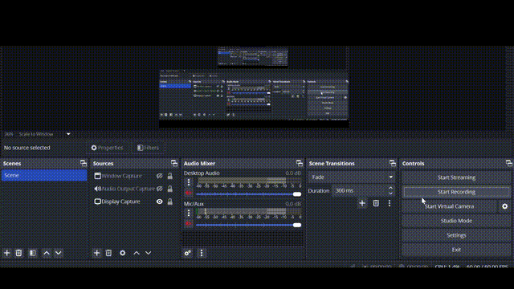

# Docker Image Security Scanner

A proof-of-concept tool for scanning Docker Hub images to detect sensitive credential leaks in configuration files.

## Overview

This tool helps identify security vulnerabilities in Docker images where developers may have unknowingly included sensitive credentials in configuration files (like `.env` files). It operates as a set of stateless microservices using Redis queues to coordinate the scanning process.

## Inspiration
This project is inspired by **GitHub’s security practices** specifically how they periodically scan for security leaks or exposed files (like `.env`) and notify the repository owner to ensure data remains secure.
## Motivation
1. Learning **Asynchronous Messaging** or **Event-Driven Architecture**
2. Understanding **Atomicity** in Redis cache.
3. Presenting a **Proof of Concept (POC)** to improve security checks.

## Demo Video
https://github.com/uditrajput03/docker-security-poc/releases/tag/0.0.1/demo.mp4


## Architecture

The system works through a pipeline of microservices:

0. Keyword Scanner: (Depreciated Not included in this repo)
1. **Username Scanner**: Retrieves image names for each username
2. **Image Scanner**: Extracts available tags for each image
3. **Tag Scanner**: Pulls image `.tar` files and scans for sensitive files
4. **Alert System**: Sends notifications when credentials are detected (currently via Telegram)

```
┌─────────────┐    ┌─────────────┐    ┌─────────────┐    ┌─────────────┐
│  Username   │    │    Image    │    │     Tag     │    │    Alert    │
│   Scanner   │───►│   Scanner   │───►│   Scanner   │───►│   System    │
└─────────────┘    └─────────────┘    └─────────────┘    └─────────────┘    
       │                  │                  │                  │       
       ▼                  ▼                  ▼                  ▼       
┌───────────────────────────────────────────────────────────────────────
│                                      Redis Queues                     │
└───────────────────────────────────────────────────────────────────────
```
## Diagram
<details style="border: 1px solid #ddd; padding: 10px; margin:20px; border-radius: 5px; box-shadow: 0 2px 5px rgba(0,0,0,0.2);">
  <summary style="font-size: 18px; cursor: pointer; font-weight: bold; color: #4A90E2;">
    ▶️ Click to show/hide diagram
  </summary>

## Diagram
Keyword Part is removed for the main repo as it is only used in poc.


## Example

</details>

## How It Works

1. Images are discovered for each username
2. Tags are extracted for each image
3. Images are pulled and scanned for sensitive files
4. Alerts are sent when credentials are detected

## Components

- `src/getImages.ts`: Retrieves images for a given username
- `src/getTags.ts`: Retrieves available tags for an image
- `src/getRedis.ts`: Handles Redis queue operations
- `src/logger.ts`: Manages logging and alerts
- `src/index.ts`: Main application entry point

## Setup and Usage

1. Clone the repository
2. Install dependencies: `npm install`
3. Configure Redis connection in your environment
4. Set up Telegram webhook (optional)
5. Provide Your username to the index.js
5. Start the service: `npm start`
6. Install `skopeo` for downloading image for worker

## Configuration

Create a `.env` file with the following variables:

```
REDIS_URL=your_redis_connection_string
TELEGRAM_BOT_TOKEN=your_telegram_bot_token
TELEGRAM_CHAT_ID=your_telegram_chat_id
```

## Disclaimer

**IMPORTANT**: This tool is provided as a proof-of-concept for educational and security research purposes only. It should be used exclusively to scan your own Docker images or those you have explicit permission to scan. Unauthorized scanning of third-party Docker images may violate terms of service, privacy laws, and computer fraud statutes.

The authors of this tool are not responsible for any misuse or damage caused by this software. Use responsibly and ethically.

## Legal Considerations

- Always obtain proper authorization before scanning any Docker images
- Do not use this tool to access, download, or expose sensitive information from third parties
- Report vulnerabilities responsibly to the image owners
- Follow responsible disclosure practices

## Contributing

Contributions are welcome! Please feel free to submit a Pull Request.

## License

This project is licensed under the MIT License - see the LICENSE file for details.
